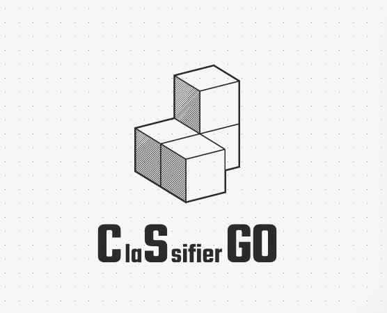

# ClaSsifierGO


O projeto consiste em utilizar redes neurais convolucionais para identificar fases do jogo Counter-Strike: Global Offensive.

A ideia do projeto surgiu pelo fato de alguns integrantes da equipe praticarem o jogo por hobby, desse modo os mesmos conheceram
uma famosa competição de jogadores profissionais que tentam adivinhar de que mapa do jogo é determinada imagem, um exemplo dessa
disputa pode ser vista [aqui](https://www.youtube.com/watch?v=Y20P4azigD4&ab_channel=BLASTPremier).

## Integrantes

| Nome | Matricula |
|--|--|
| Matheus Gabriel | 18/0106970 |
| Dara Maria | 20/2046040 |
| Lucas Andrade | 18/0105256 |
| Jose Vitor | 19/0089971 |
| João Pedro | 19/0057815 |

## Como executar

### BackEnd 

* **Instalar dependências:**
```bash
pip install flask flask_cors pillow tensorflow
```
* **Executar BackEnd:**
```bash
python backend/main.py
```
### FrontEnd

* **Acessar pasta FrontEnd:**
```bash
cd frontend
```
* **Instalar dependências:**
```bash
yarn install
```
* **Executar FrontEnd:**
```bash
yarn start
```
